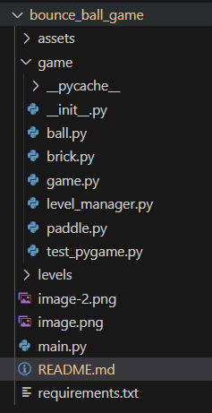
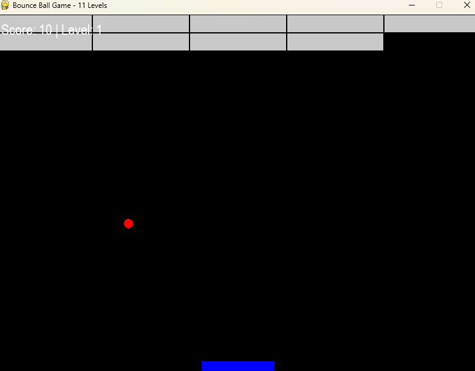

# 🧱 Bounce Ball Game 🎮

A classic brick-breaker style game built with **Python** and **Pygame**, featuring 11 levels of fun, increasing difficulty, paddle-ball physics, and dynamic gameplay mechanics.

---

## 🚀 Features

- 🧩 11 Unique Levels
- 🔴 Bouncing ball physics with wall, paddle & brick collisions
- 🎮 Smooth paddle control using arrow keys
- 🧱 Brick breaking logic
- 🔁 Level progression and reset system
- 📦 Modular code structure (OOP)
- 🪄 Game Over screen with Restart button

---

## 🖥️ Gameplay

Use:
- **← Left Arrow** to move paddle left  
- **→ Right Arrow** to move paddle right  

Break all bricks to move to the next level. If the ball falls below the paddle, it's game over!

---

## 📁 Project Structure



---

---

## 🛠️ Installation

1. Clone the repo:
```bash
git clone https://github.com/RoBiul-Hasan-Jisan/bounce-ball.git
cd bounce-ball
```

 ## Create a virtual environment
---
python -m venv venv
source venv/bin/activate  # On Windows: venv\Scripts\activate
---


## nstall dependencies

pip install -r requirements.txt

## Run the game

python main.py


## 📸 Screenshots

##  Author

Developed by Robiul Hasan Jisan 

## Contribute

Pull requests, ideas, and improvements are welcome. Let's make this game more exciting together!


---

Would you like me to generate a `requirements.txt` file as well or add cool badges

---


